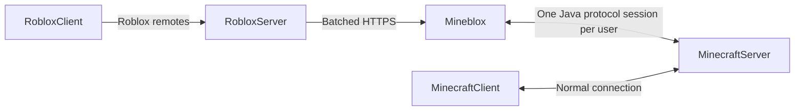

# Mineblox

An experimental bridge that lets Roblox frontends control **real Minecraft Java
protocol players** in an authoritative Minecraft world. Native Minecraft users
connect normally. Minecraft owns game rules; Roblox will provide input, rendering,
prediction and UI. This is an independent open-source project, unaffiliated with
Mojang, Microsoft or Roblox.



## Status

The first prototype targets Minecraft Java **1.21.4**, Node **24**, and a
loopback-only offline development server. It implements headless protocol
sessions, CLI movement/look, authenticated HTTP input/state batching, leases and
cleanup. Chunk extraction, binary snapshots, revision-safe deltas and independent
cube greedy meshing are tested. There is an optional mcasset.cloud/local asset
cache. See [validation and measured results](docs/benchmarks.md).

The Roblox transport module is experimental and has not been run in Studio.
There is **no complete Roblox renderer or playable crossplay experience yet**.
Combat, block actions, inventory, continuous terrain/entity replication, online
authentication, client prediction and reconciliation remain planned.

## Local development

Requirements: Node 24, npm, Java 21 or newer for the pinned development server,
Git; a Minecraft 1.21.4 client for optional visual inspection. No Go/Rust toolchain
or Docker is required for this slice.

```sh
npm ci
npm run minecraft:prepare
```

The setup downloads the official pinned server into ignored `.local/minecraft`,
checks Mojang's metadata/JAR hashes, binds it to 127.0.0.1 and leaves `eula=false`.
Review the [Minecraft EULA](https://www.minecraft.net/en-us/eula) and explicitly
set `eula=true` in `.local/minecraft/eula.txt` if you accept, then start the server:

```sh
npm run minecraft:start
```

In another terminal, prove server-replicated movement with two headless connections:

```sh
npm run test:live
npm run player -- 123
```

The live test records `.local/live-smoke.json`, a bounded voxel snapshot and cube
preview. The CLI joins as `RB123`; `forward`, `stop`, `look 0.5 0.1`, `state`, `quit`
control it. Combine control names, for example `forward sprint`. Held movement
expires after 1.5 seconds unless renewed. A normal Java 1.21.4 client can connect
to `127.0.0.1:25565` and observe the player. Close the server with `stop` in its
console. Offline mode is development-only and must never be exposed publicly.

## HTTP gateway

Copy `.env.example` to `.env` and replace BRIDGE_TOKEN with at least 32 random
characters. Start the Minecraft server, then:

```sh
npm run dev
```

Gateway defaults to 127.0.0.1:8080. Every endpoint requires bearer auth. POST
`/v1/sessions` with `{ "version": 1, "robloxId": "123" }`; use the returned ID
in `/v1/exchange` or `/v1/sessions/<id>/input`. Input contains only version, seq,
controls and yaw/pitch. [Protocol reference](docs/protocol.md) describes the schema,
limits and prediction/correction distinction. A bearer-authenticated Roblox
server is trusted to establish identity; direct Roblox clients cannot hold this key.

[Roblox setup](roblox/README.md) explains the shared 5 Hz HTTPS batching experiment.
Published Roblox servers need a reachable HTTPS gateway; localhost is for local
tools. No external hosting/tunnel is provisioned by this repository.

## Textures and models

mcasset.cloud is supported as an optional **development/build asset source**:

```sh
npm run assets -- --remote --version 1.21.4 assets/minecraft/models/block/stone.json
```

Assets stay in ignored versioned cache with SHA-256 metadata. Local user-provided
extraction works too. No Minecraft textures/models/JARs are distributed here.
Service access does not establish asset redistribution or Roblox upload rights;
see [asset pipeline](docs/assets.md) and [rendering constraints](docs/rendering.md).

## Quality checks

```sh
npm run format:check
npm run lint
npm run build
npm test
npm run test:integration
npm run bench
```

Tests run without Minecraft credentials, game binaries or Roblox Studio. The TCP
fixture validates serialized protocol behavior; `test:live` is the separate real
Minecraft authority/observer check. Build performs JavaScript syntax validation.
CI uploads benchmarks without claiming stable numeric regression thresholds.
On the founding workstation, prefix shell commands with `rtk proxy` and use
`npm.cmd`; portable project commands above require no RTK installation.

Read [architecture](docs/architecture.md), [ADR](docs/adr/0001-authoritative-server-headless-adapter.md),
[research](docs/research.md), [security/dependency audit](docs/security.md),
[roadmap](docs/roadmap.md), and [agent instructions](AGENTS.md) before extending
the bridge. Go/Rust alternatives were evaluated; the initial single-runtime
adapter prioritizes the first working protocol slice.
