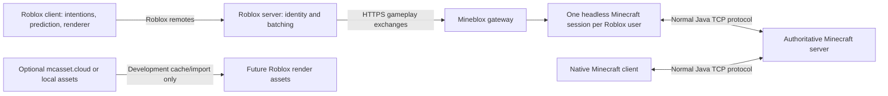

# Architecture

Gateway, headless sessions, Minecraft protocol and the local Roblox Studio
frontend have been validated together. Studio uses authenticated loopback HTTP;
published deployment still requires HTTPS. Minecraft is the only gameplay authority.

## Ownership and boundaries

VirtualPlayer owns bridge identity, delivery sequences, leases and a reference
to Mineflayer; the library owns the virtual client's player/world state. Incoming
intentions are validated full held-control states plus look. Position, damage,
inventory and block results are never accepted from the frontend. Server health,
food and correction packets are exposed separately from predicted position.
Corrections retain their own revision. acceptedSeq means accepted by the bridge,
not applied or acknowledged by Minecraft.

The world model stores version-local state IDs in bounded regions. The render
model holds merged quads and later non-cube geometry. Input control and gameplay
authority do not depend on the mesher. Snapshot/delta modules are pure and tested;
continuous bounded terrain streaming is wired to a separate HTTP endpoint and
worker. Mineflayer keeps the canonical decoded voxel world separately from meshes.

## Transport and prioritization

Minecraft uses ordinary TCP. Published Roblox server scripts use HTTPS with
batched gameplay request/response exchanges (initial 5 Hz). No custom UDP is
needed yet. Roblox remotes form the frontend/server boundary. Production terrain
must use an independently budgeted endpoint and worker queue, never a giant
payload in /v1/exchange. A bounded worker performs meshing; the gateway samples
small loaded partitions and maintains revision/cache metadata. Gameplay and
terrain have independent in-flight work and shared platform request limits.

Planned traffic classes: P0 held input/corrections, P1 combat/discrete events,
P2 nearby entities, P3 block deltas, P4 terrain, P5 background detail. Reserved
request capacity is necessary but does not remove HTTP head-of-line effects,
event-loop contention, or shared platform throttling. Benchmark real Roblox RTT.
Bound queues, coalesce replaceable state, drop distant updates first, and resync
reliable world data on revision gaps. Never coalesce away damage/death events.

## Planned cache and presentation

Shared cache keys: server + world epoch + dimension + chunk/subchunk coordinates.
Store palette/block IDs, revision, block entities and metadata; entity lifecycle
has separate IDs/spawn generations. Negative coordinates use floor division.
Bound delta journals and fall back to a snapshot when history is missing. Interest
regions follow world movement, while camera frustum/culling stays client-local.
Reconnect starts a new session/epoch, not continuation of an old input sequence.

The shipped camera responds to look input immediately. Position presentation
extrapolates Mineflayer's velocity for at most 200 ms, smooths small errors and
snaps corrections/large errors. It freezes extrapolation on loss; it does not
implement independent authoritative gameplay physics. Remote entities are
interpolated simple visual models. Full timestamped entity buffers, equipment,
skins, damage/removal/death event journals and input replay remain future work.

## Lifecycle and scalability

Each session reserves its identity before waiting for spawn, preventing duplicate
login races. Spawn failure, kick/error, idle expiry, DELETE and shutdown clean up
the connection/mapping. Held movement expires after 750 ms without a new frame;
30 seconds without accepted input removes the session. The standalone CLI uses
a 1.5-second movement lease for manual commands.

One trusted Roblox server per gateway and at most 16 sessions are development
limits. Production needs verified game-server ownership, per-owner quotas,
account linking, token rotation, session-resume semantics, bounded adapter cache,
workers, metrics and load tests. Do not imply the 16-session limit is benchmarked
capacity. Session transport changes should follow ADR 0001.

The Ender Dragon remains a future integration stress test: multipart entities,
crystals, explosions, blocks, projectiles, inventory, death/respawn and dimensions
must pass through generic state/event replication, not special client game logic.
